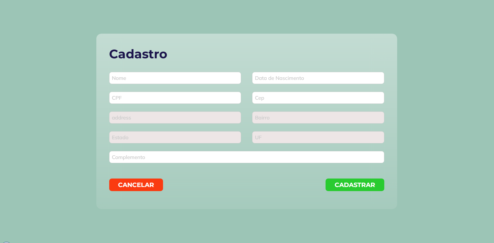

<h1 align="center"> Form React </h1>

<div align="center">
    
</div>


## Descrição

Criação de um formulario basico de cadastramento que incluir os campos nome, data de nascimento, cpf, cep, endereço, Bairro, Estado, Uf e complemento. alem disso existe validação de campos e busca de cep utilizado uma api. 

## Desafio proposto

os usuários devem ser capazes de:

* Visualize o layout ideal para o formulario, dependendo do tamanho da tela do dispositivo
* Cadastrar as informações nos campos
* Visualizar as mensagens de alerta de campos obrigatorios
* Visualizar mensagem de sucesso e erro do cadastro

## Construído com

* [React](https://www.w3schools.com/REACT/DEFAULT.ASP) - O React é uma biblioteca JavaScript de código aberto com foco em criar interfaces de usuário em páginas web. É mantido pelo Facebook, Instagram, outras empresas e uma comunidade de desenvolvedores individuais. É utilizado nos sites da Netflix, Imgur, Feedly, Airbnb, SeatGeek, HelloSign, Walmart e outros.

## Instalação Local

Para executar esse projeto você precisara do [Node](https://nodejs.org/en/).

Por meio dele sera baixado todas as depedencias do projeto, depois de instalado execute os comandos abaixo na linha do terminal.

1) Faça o clone do projeto

```bash
   git clone git@github.com:Cesar959/form-react.git
```

2) para baixa todas as dependencias do projeto

```bash  
npm install
```

3) Execute o comando abaixo no terminal

```bash 
npm run dev
```

4) Acesse "http://localhost:3000/

## Status do Projeto

**Concluido**: O projeto esta terminado, não havera futuras alterações de funcionalidade.

## Autor

* **Cesar dos Santos de Almeida** - *responsável pela construção e desenvolvimento do projeto*

## Licença
Este projeto está licenciado sob a licença MIT - consulte o arquivo  [LICENSE.md](LICENSE.md) para obter detalhes


## Links
* [Demo](https://imaginative-madeleine-385f36.netlify.app/) - link da demonstração ao vivo
* [layout](https://www.figma.com/file/k3mjL5CqpVeWKJpY2ECcS3/cadastro-vagar-frontend?node-id=0%3A1) - layout desenvolvidor


